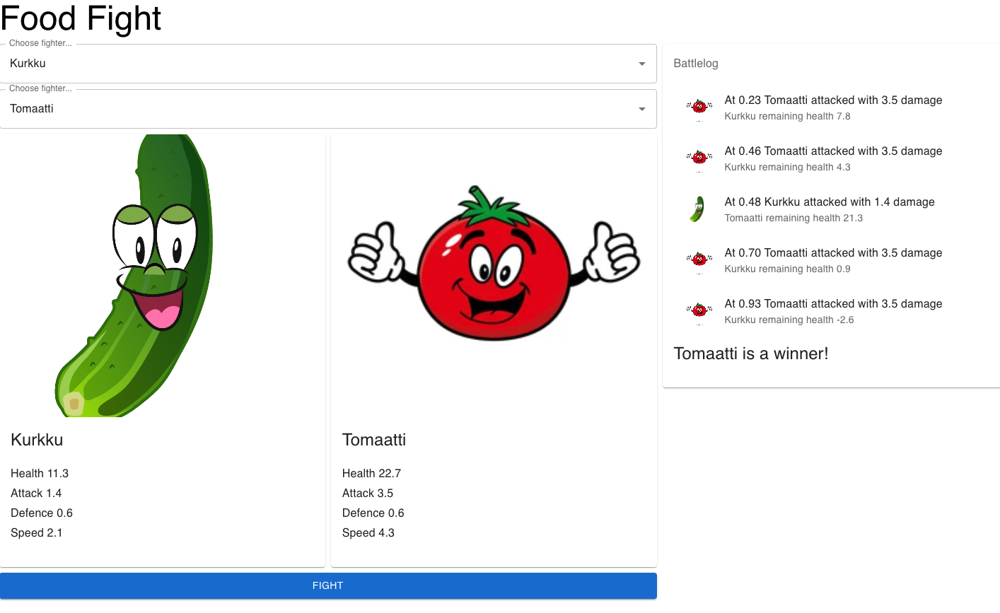

# Food Fight

Solidabis koodihaaste 2022

## Summary
This project was bootstrapped with [Create React App](https://github.com/facebook/create-react-app).

## Interface


1. Contains 2 text inputs to fetch foods. Start typing and it will try to autocomplete with any possible foodname that is found from backend. 
2. Once both fighters are selected, click fight and fight is initiated in the backend. Be patient, it might take couple of seconds until results are printed to battlelog. There is no loading icon implemented.


### Available Scripts

In the project directory, you can run:

#### `npm start`

Runs the app in the development mode.\
Open [http://localhost:3000](http://localhost:3000) to view it in your browser.

The page will reload when you make changes.\
You may also see any lint errors in the console.

#### `npm run build`

Builds the app for production to the `build` folder.\
It correctly bundles React in production mode and optimizes the build for the best performance.

The build is minified and the filenames include the hashes.\
Your app is ready to be deployed!

See the section about [deployment](https://facebook.github.io/create-react-app/docs/deployment) for more information.

### Run local
Run commands below in terminal, root of the project
```
npm install
npm run start
```
Open http://localhost:3000 in your browser